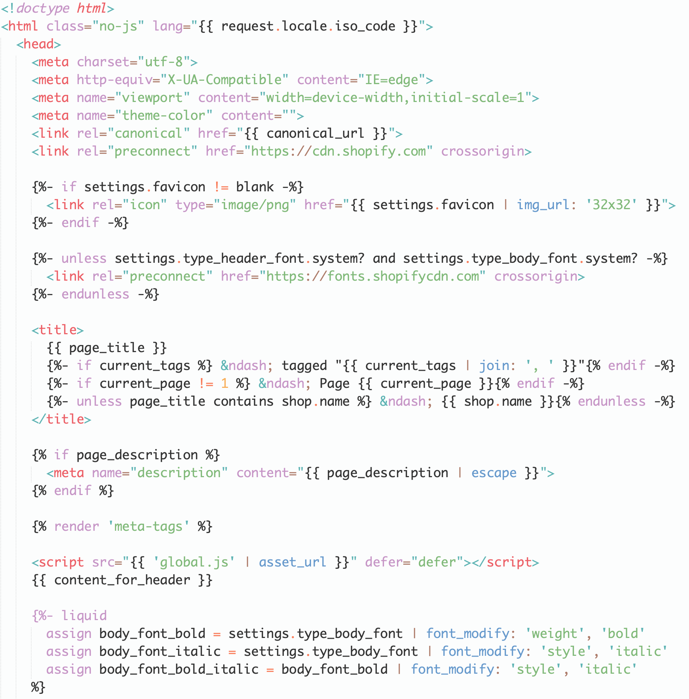

# shopify-liquid-sublime

Language definition for [shopify liquid](https://shopify.dev/api/liquid)

## Installation

Find it as **shopify-liquid** through [Package Control](https://packagecontrol.io/).

#### Setting as the default syntax

To set it as the default syntax for a particular extension:

1. Open a file with that extension,
2. From the `View` menu, select `Syntax` → `Open all with current extension as…` → `Liquid`

## Screenshots

